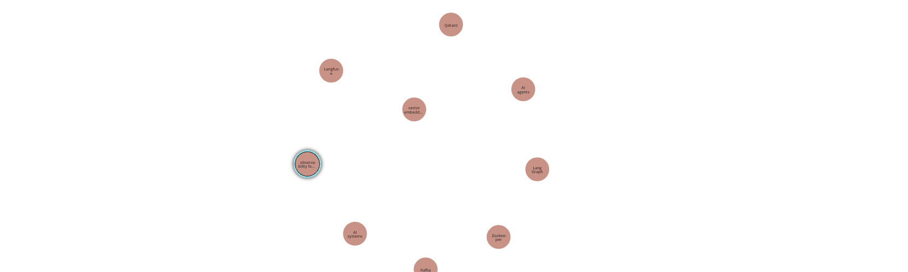
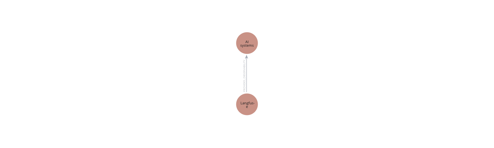

## Architecture of the KnowledgeGraph RAG

```
Documents
   ↓
Chunking
   ↓
Entity Extraction
   ↓
Relationship Extraction
   ↓
Knowledge Graph
   ↓
Graph Retrieval
   ↓
LLM

```

## Steps Involve in it 
- `RecursiveCharacterTextSplitter` : Normal as usual chunkings
- `Use LLM or NLP` : For Entity Extractions 
     - Example entities:

            * Kafka
            * LangGraph
            * Qdrant
            * Zookeeper

- ` For Extracting Relationship ` : Relationship Extraction 

  ```
      Kafka -> uses -> Zookeeper

  ```
-  ` Storing these in GraphDB` : GraphDB List 

      - Usually:

            * Neo4j
            * NebulaGraph
            * ArangoDB
            * TigerGraph
- ` Query To Graph`
   ```
      Find systems related to Kafka
   ```

- `Send Context To LLM`

  - LLM now receives:

            * graph relations
            * semantic context
            * retrieved chunks

## For Running the Neo4j GrpahDb Locally 
- You should have docker in your system : 
  - 
   ```
            docker run \
            --name neo4j \
            -p 7474:7474 \
            -p 7687:7687 \
            -e NEO4J_AUTH=neo4j/password \
            -d neo4j
   ```

   - [ http://localhost:7474/browser](http://localhost:7474/browser/)

- Install the python packages listed in requirement.txt file : 
  ```
      pip install networkx matplotlib

      pip install \
      neo4j \
      langchain-text-splitters \
      langchain-openai \
      sentence-transformers
  ```
- Now run the Python  `knowldege_graph_rag.py`
   - Letme show you how  Nodes getting stored in the Neo4j Db for the above code example , into the  Knowldege-graphDb : 
   

   - Letme show you how  Nodes Relations stored in the Neo4j Db for the above code example , into the  Knowldege-graphDb : 
   

